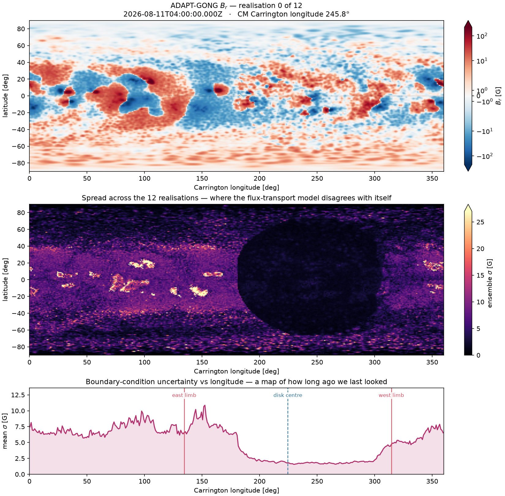
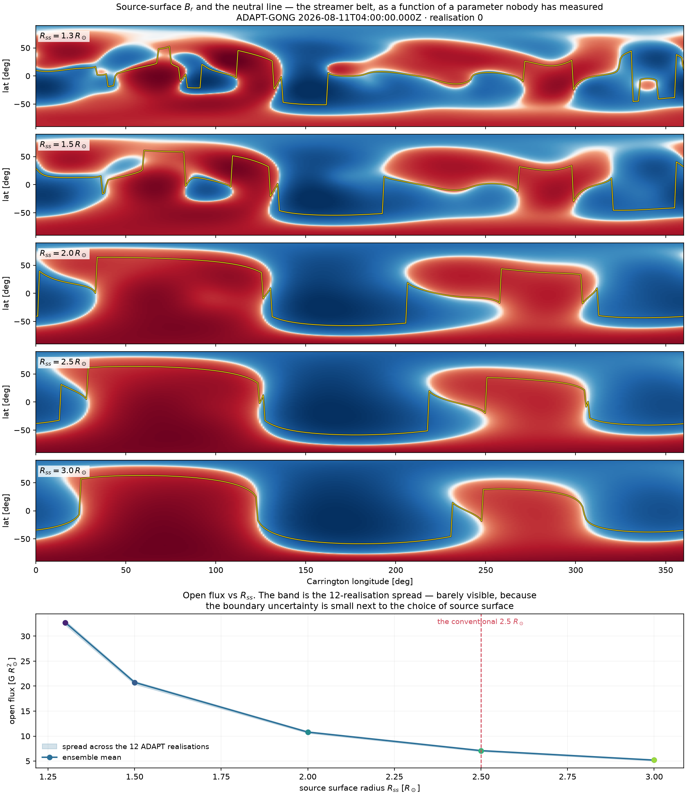
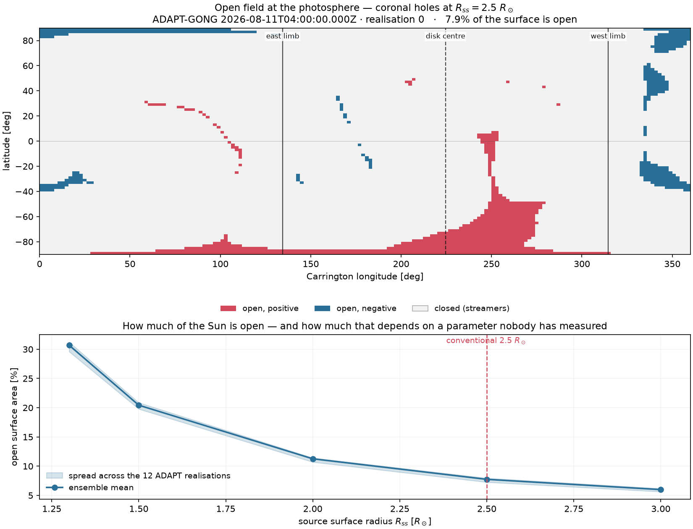
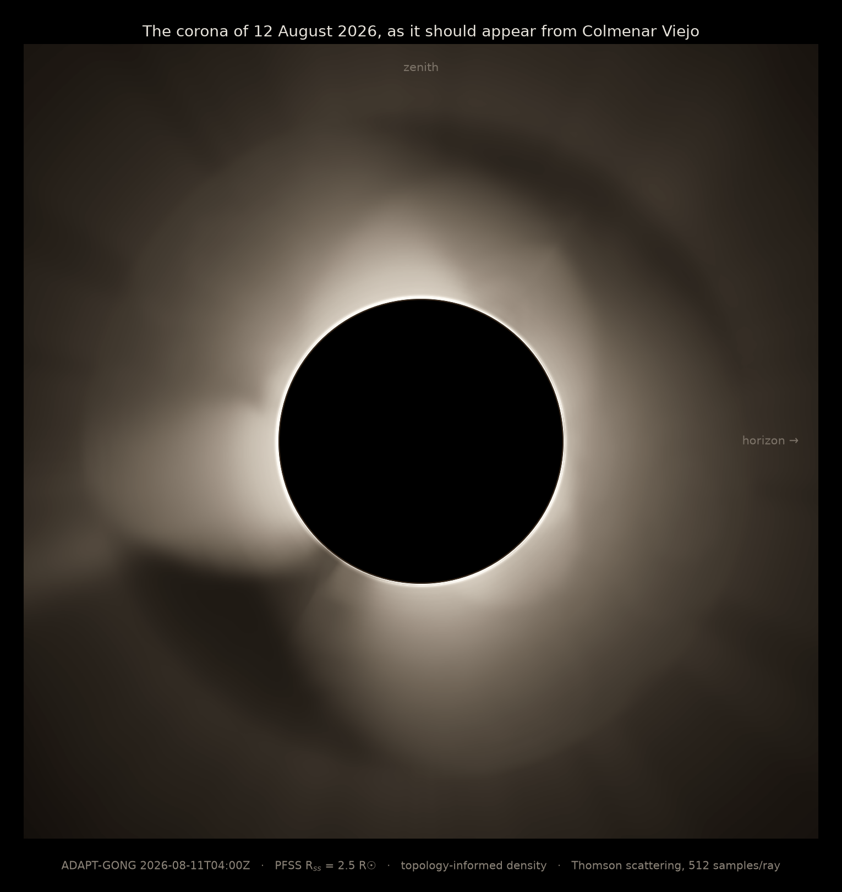

# corona26

Predicting the corona of the 12 August 2026 total solar eclipse from real
photospheric magnetic-field data — PFSS reconstruction, a topology-informed
electron-density proxy, and an exact Thomson-scattering renderer.

> **Status: Phases A–E complete. There is a prediction.**
> Written 11 August 2026, the day before totality.
>
> Live write-up: **[www.fullfran.com/corona26](https://www.fullfran.com/corona26/)**

## The question

> **Can I predict tomorrow's solar corona from today's magnetic field?**

Tomorrow evening I am going to stand in a field near Colmenar Viejo, north of
Madrid, and for 37 seconds the Moon will remove the Sun and leave the corona
visible. Today the Sun's magnetic field has already been measured.

Those two facts are separated by about thirty hours and a great deal of
physics. This repository is an attempt to cross that gap and then find out, by
looking up, how badly I got it wrong.

The appeal is the deadline. Most models are validated against archived data
you could, in principle, have peeked at. This one gets graded by an event that
has not happened yet, against a dataset nobody can argue with.

## How this started

I built [`snow-mcrt`](https://github.com/FullFran/snow-mcrt) to answer whether
I could simulate light in a disordered medium correctly enough to be believed —
photons scattering thousands of times inside snow, `τ ≫ 1`, multiple scattering
as the whole problem.

The corona is the same physics standing on its head. Free electrons instead of
ice grains, and an optical depth of about **10⁻⁶**. A photon that scatters
once effectively never scatters again. There is no transport equation to
solve — just one exact integral along each line of sight, over hundreds of
millions of sample points that do not talk to each other.

Which is a way of saying: the hard part is not the radiation. It is knowing
where the electrons are. And nothing measures that directly.

## What this is

A five-stage pipeline, each stage stating its own approximation:

```
ADAPT-GONG magnetogram          real measurement, far side modelled
  → PFSS ensemble               current-free field, 5 source-surface radii
  → open/closed topology        streamers, coronal holes, the streamer belt
  → electron density proxy      empirical — this is the weak point, and it is labelled
  → Thomson scattering + LOS    exact, single-scattering, written from scratch
  → synthetic K-corona          oriented for Colmenar Viejo, 20:31 CEST
```

Full derivations, every equation, and a table of all eight approximations
ranked by risk: [`docs/physics.md`](docs/physics.md).

## What it is not

**This is not a thermodynamic MHD model.** It does not solve for plasma. It
has no heating, no wind, no time evolution. Where
[Predictive Science](https://eclipse.predsci.com/) run a time-dependent MHD
model assimilating far-side magnetograms from Solar Orbiter/PHI, this runs a
static potential-field extrapolation and multiplies the answer by an empirical
density profile.

They will be better than us. That is the point of having them as a baseline.
The interesting question is *where* the cheap model breaks and by how much.

## The uncomfortable part, measured in advance

The dominant error is not the renderer and it is not even PFSS. **It is that
we cannot see the far side of the Sun.**

Global magnetic maps reconstruct the hidden hemisphere with a surface
flux-transport model. In August 2026 the Sun is near cycle maximum and active
regions evolve in days. If a region large enough to anchor a helmet streamer
emerged out of sight, our streamer belt is wrong, and no amount of resolution
fixes it.

So we do not publish one image. ADAPT ships **12 realisations** of the boundary
condition; we run **5 source-surface radii**. That is a 60-member ensemble, and
its spread is the error bar.



**Boundary condition in hand** — ADAPT-GONG, observed **2026-08-11 04:00 UTC**,
1° × 1° global grid, 12 realisations, central meridian at Carrington longitude
245.8°. It is well-behaved where it should be: the residual monopole is
`|∮Br dA| / ∮|Br| dA = 0.03%`, and total unsigned flux varies by only **1.14%**
across the twelve realisations.

That last number is misleading on its own, and the middle panel is why.

### Phase A found something the plan did not anticipate

The realisations agree almost exactly on *how much* flux there is. They
disagree sharply on *where it is* — and the disagreement is not uniform. It is
organised by longitude, and the organisation is a straight readout of **how
long ago each part of the Sun was last observed**:

| At totality (`L0 = 224.5°`) | Carrington longitude | Ensemble spread |
|---|---|---|
| Disk centre | 224.5° | **1.85 G** |
| West limb | 314.5° | 4.11 G |
| **East limb** | **134.5°** | **7.71 G** |

The Carrington longitude of the central meridian *decreases* with time, so
material arrives at disk centre from lower longitudes. The east limb is the
edge that most recently rotated out of the far side — the longest unobserved,
the most extrapolated.

**It carries 4.2× the boundary uncertainty of disk centre.** And on an eclipse
image the limbs are exactly where the plane-of-sky structure lives: streamers
are seen edge-on, against the sky, at the limbs. The one part of the corona we
will actually be looking at is anchored in the worst-constrained part of the
input.

This is a falsifiable, pre-registered prediction about our own failure mode:
**if this model fails tomorrow, it should fail asymmetrically, worse on the
east limb.** If it fails symmetrically, the far-side field was not the problem
and something else is — the source surface, or the density proxy.

That is a better thing to have before an experiment than a confident picture.

## Phase B: the field, and which uncertainty actually dominates



Sixty solves — 12 ADAPT realisations × 5 source-surface radii — in **124
seconds** on a laptop CPU. The ensemble was never the expensive part.

Before trusting any of it, the solver is checked against a case with a closed
form. For a pure dipole boundary only the `l = 1` harmonic survives and the
potential reduces to `Φ = (a r + b/r²) cos θ`; applying `Bθ(Rss) = 0` and
`Br(1) = b0` gives

```
Br(r, θ) = b0 cos θ · (Rss⁻³ + 2 r⁻³) / (2 + Rss⁻³)
```

The numerical solution reproduces this at the source surface to 5%, with the
polarity the right way round, and it reproduces the input boundary map to
**0.03% RMS**. Sign conventions, normalisation and the upper boundary
condition are all pinned by that one test.

### Then the interesting part

The top five panels are the same Sun with a different source surface. They are
not the same picture at different scales — **the topology changes**. Counting
polarity reversals per longitude on the source surface:

| `Rss` | Reversals per longitude | Open flux (G R☉²) |
|---|---|---|
| 1.3 | 2.63 | 32.7 |
| 1.5 | 2.09 | 20.8 |
| 2.0 | 1.56 | 10.8 |
| 2.5 | 1.31 | 7.1 |
| 3.0 | 1.14 | 5.2 |

At `Rss = 1.3` the belt is multi-branched: several distinct streamers, a
neutral line that wanders 50° in latitude. At `Rss = 3.0` it has collapsed to
a single clean two-sector belt. **These predict visibly different eclipses.**

### The number, stated carefully

Open flux varies **48×** more across the five source surfaces than across the
twelve realisations of the boundary. That comparison flatters the point and we
are not going to lead with it: open flux is measured *at the source surface*,
whose radius is the parameter being varied, so some of that ratio is
definitional rather than physical.

The honest metric is the one an eclipse actually shows — where the streamer
belt sits on the sky:

| Neutral-line latitude, RMS scatter | |
|---|---|
| across 12 ADAPT realisations, fixed `Rss` | **5.3°** |
| across 5 source surfaces, fixed realisation | **20.5°** |
| ratio | **3.8×** |

So the ranking from Phase A survives, but with a corrected magnitude. **The
source-surface choice moves the streamer belt about four times as much as the
entire far-side uncertainty does** — not fifty. Both matter; the fictional
parameter matters more.

Which means the ensemble is not decoration. Publishing one image at
`Rss = 2.5` because that is what everyone uses would have hidden the single
largest source of error in the prediction.

## Phase C: where the wind escapes



Field lines integrated from **16,200 equal-area photospheric seeds** and
classified. Closed lines return to the surface at both ends — they trap plasma,
are overdense, and build the streamers. Open lines reach the source surface —
plasma escapes as solar wind, the region is underdense, and it forms a coronal
hole, dark in white light.

Two correctness details that fail silently, so both are tested:

- **Seeding is uniform in sin(latitude), not latitude.** A uniform-latitude
  grid over-samples the poles, and an "open fraction" computed from it is not
  an area fraction at all.
- **The classification is converged.** A field line that exhausts its step
  budget mid-flight is indistinguishable from one that escaped. Doubling the
  budget changes **zero** of 16,200 seeds.

For the analytic dipole the topology is exactly known, and the tests assert it:
open polar caps, closed equatorial belt, exactly two transitions reading down
any column of longitude, and opposite polarity in the two caps.

| `Rss` | Open surface area | Boundary spread |
|---|---|---|
| 1.3 | 30.69% | 1.64 pp |
| 1.5 | 20.43% | 1.10 pp |
| 2.0 | 11.26% | 0.72 pp |
| 2.5 | **7.74%** | 0.70 pp |
| 3.0 | 5.99% | 0.56 pp |

**This ratio is a clean one.** Open area varies **26×** more across source
surfaces (24.7 percentage points) than across boundary realisations (0.94 pp).
Unlike the open-flux comparison above, nothing here is definitional: open area
is always measured at the *photosphere*, a fixed radius, while the parameter
being varied lives far above it. Choosing `Rss = 2.5` instead of `1.5` changes
how much of the Sun is open from 20% to 8%.

At `Rss = 2.5`, 65% of the open flux is positive, and the median flux-tube
expansion factor is 6.6 — which is the quantity that will modulate the electron
density in Phase D, rather than a binary open/closed flag.

## Phases D and E: the prediction



**This is what the model says the corona will look like from a field north of
Madrid at 20:31 CEST tomorrow.** Zenith is up, so this is the orientation the
eye sees, not the solar-north-up convention: solar north is tilted 34.7° from
vertical, a number measured by projecting the solar pole into the local
horizontal frame rather than assembled from the position and parallactic
angles, whose sign convention is easy to get backwards.

Two things had to be true before the image meant anything.

**The scattering had to be exact.** The Sun is not a point source — an electron
at 1.5 R☉ sees a disk 42° wide — so the scattering angle varies across the
disk and must be integrated over it with limb darkening. Van de Hulst (1950)
did that integral analytically, leaving four closed-form coefficients. The
decisive test is that far from the Sun the full finite-disk kernel must
collapse onto the textbook dipole pattern:

```
B(chi) / B(90°)  →  1 + cos²(chi)      as r → ∞
```

It does, to 0.2%. That single check pins the sign, the normalisation and the
whole disk integral at once — nothing else in the kernel can be wrong while it
passes.

**The quadrature had to be converged.** Measured, not assumed: at 512 samples
per ray the line-of-sight integral is within **0.98% worst-case and 0.001%
median** of an 8192-sample reference.

| | |
|---|---|
| Kernel evaluations | 415M per frame (900² × 512) |
| Render time | 118 s per frame, NumPy on CPU |
| Density cube | 48 × 96 × 192, 884k field lines traced |
| Peak memory | **1.8 GB, flat in resolution** |
| Degree of polarisation | 0.20–0.75, median 0.61 |

### What is honest about this image and what is not

The **geometry** is real: observer position, solar orientation, scattering
angles, the occulting disk. The **scattering** is exact. The **magnetic
topology** is a genuine PFSS solution from a real magnetogram.

The **density is a proxy** — closed field 3.5× enhanced, open field 0.4×
depleted, on top of a Baumbach–Allen radial profile. Those numbers are knobs,
fixed before any comparison with Predictive Science so that we cannot tune our
way into agreement.

And the structure is **too smooth**. Real coronae show fine radial striations;
a potential field with a two-valued density proxy cannot produce them. If
tomorrow's corona is sharper and more filamentary than this — and it will be —
that is the density model failing, not the renderer.

### A note on compute

The first attempt at this OOM-killed the machine three times. The cause was not
the renderer: it was that the field-line tracer preallocates a buffer of
`n_seeds × max_steps`, so asking for 328k lines at once requested ~70 GB before
tracing a single one. Batching the trace made peak memory constant. The whole
pipeline now runs in **1.8 GB and about six minutes on a laptop CPU** — no GPU
required for V1, which was rather the point.

## Where the compute goes

One place: the line-of-sight integral. A 1024² image at 512 samples per ray is
~5×10⁸ independent kernel evaluations with no coupling between them — an
embarrassingly parallel map-reduce, and the one part of the pipeline where a
GPU is obviously correct.

Written against NumPy first as the reference implementation, then JAX
`jit`/`vmap` for the same equations at speed, rendered in tiles.
The two backends must agree.

Local hardware is an RX 6600 (gfx1032) with no ROCm userspace installed and a
known segfault regression on that architecture, so the full render runs on a
Kaggle T4. **Kaggle is compute, not architecture** — everything runs on CPU at
reduced resolution, and does so before it runs anywhere else.

## Where we will be looking

Computed with astropy/sunpy for Colmenar Viejo (40.659° N, 3.768° W, 1004 m)
at 2026-08-12 18:31 UTC:

| | |
|---|---|
| Solar north position angle `P` | 15.19° |
| Heliographic latitude of disk centre `B0` | 6.51° |
| Carrington longitude `L0` | 224.53° |
| Solar angular radius | 15.78′ |
| **Sun altitude** | **7.55°** |
| **Sun azimuth** | **283.04°** (WNW) |

`B0 = 6.51°` means we look slightly down on the north pole: the southern polar
coronal hole is foreshortened, the northern one better exposed. `P = 15.19°`
sets the rotation of the whole corona on the sky — an image with solar north up
is not what a camera on a tripod records, so both are produced.

And 7.55° of altitude means the corona will appear low over the horizon, deep
in atmosphere, in the direction of the Sierra de Guadarrama. The observing site
has to be picked against a horizon profile, not a map.

## Validation

Three baselines, in increasing order of severity:

1. **Predictive Science / MAS** — the professional MHD prediction, which
   publishes a Spain-oriented view.
2. **The Sun**, at 20:31:xx CEST on 12 August. No appeal.
3. **Ourselves** — the 60-member ensemble spread.

Compared with numbers, not vibes: streamer position angles extracted from
angular intensity profiles on rings at 1.5, 2.0 and 2.5 R☉, plus angular
correlation and IoU of binarised bright regions. Identical radial filtering
applied to all three images, because comparing differently-processed pictures
is the easiest way to produce a meaningless figure.

The standing rule from `snow-mcrt` applies: **publish against an explicit
baseline, including where we lose.** We already know we lose. The result is
characterising how.

## The prediction is timestamped

The synthetic corona and the magnetogram it came from are committed and pushed
**before totality**, with the input observation time recorded in a manifest.
The git history is the evidence. A prediction published afterwards is not a
prediction.

## Success criteria

V1 succeeds if the pipeline runs, the figures exist and the approximations are
stated honestly — **regardless of whether the prediction is any good.**

If the corona matches, that is a result. If it does not, working out why
(far-side field? source surface? density proxy? missing plasma physics?) is a
better one. The failure mode is not a wrong prediction. It is no prediction.

## Documentation

| | |
|---|---|
| [`docs/physics.md`](docs/physics.md) | Every equation, every approximation, ranked by risk |
| [`docs/scope.md`](docs/scope.md) | What V1 does and explicitly does not do |
| [`docs/architecture.md`](docs/architecture.md) | Pipeline design and the seven decisions behind it |
| [`docs/plan.md`](docs/plan.md) | Phases, fallbacks, and the hour-by-hour run to totality |
| [`docs/bib/references.md`](docs/bib/references.md) | Sources, from Minnaert 1930 to Rice 2026 |

## Running it

```bash
uv sync
uv run python -m corona26.pipeline --help    # not yet implemented
```

Python 3.12 (the 3.14 system interpreter has no reliable scientific wheels),
sunpy 8.0, sunkit-magex 1.1, astropy 8.0.

## Licence

MIT.
